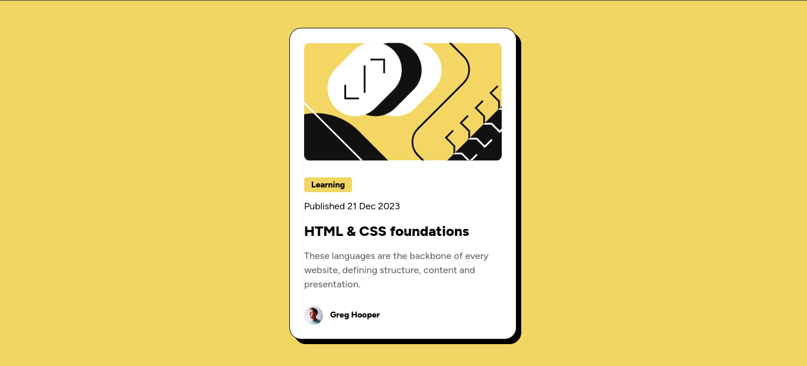

# Frontend Mentor - Blog preview card solution

This is a solution to the [Blog preview card challenge on Frontend Mentor](https://www.frontendmentor.io/challenges/blog-preview-card-ckPaj01IcS). Frontend Mentor challenges help you improve your coding skills by building realistic projects. 

## Table of contents

- [Overview](#overview) 
  - [Screenshot](#screenshot)
  - [Links](#links)
- [My process](#my-process)
  - [Built with](#built-with)  
  - [Useful resources](#useful-resources)
- [Author](#author) 

## Overview 

### Screenshot

 

### Links

- Solution URL: [Github Repo](https://github.com/shad0w-max/blog-preview-card)
- Live Site URL: [Live Site](https://shad0w-max.github.io/blog-preview-card/)

## My process

### Built with

- Semantic HTML5 markup
- CSS custom properties
- Flexbox 
- Mobile-first workflow 

### Useful resources

- [CSS variables](https://www.w3schools.com/css/css3_variables.asp) - This helped me to learn about variables in CSS. I really liked this pattern and will use it going forward. 

## Author
 
- Frontend Mentor - [@shad0w-max](https://www.frontendmentor.io/profile/shad0w-max)
- X(Twitter) - [@shad0w_max](https://x.com/shad0w_max)
 
 
